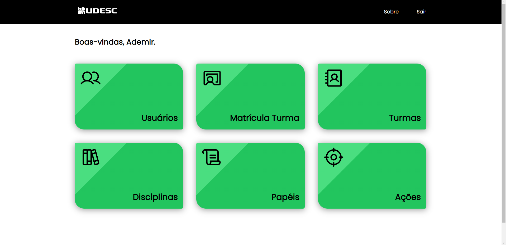
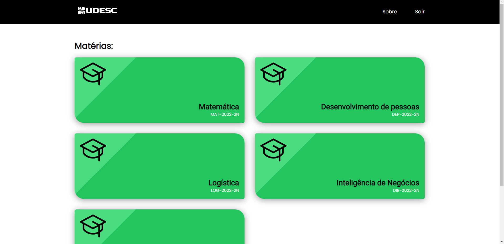
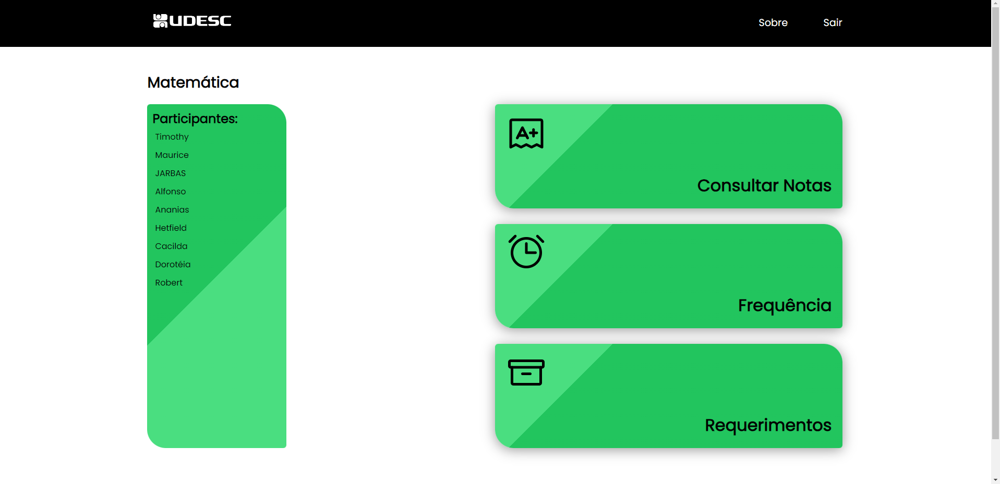

# Academic Management System

The academic control system is a project that was developed during my internship. The project simulates a school system for tracking grades, enrolled subjects and subject members.

## Pages
The system was made for both the student and the admin. The admin can create teachers, subjects, give grades, create classes, among other functions. Students can access their subjects and see their grades and class members.
### Admin Home Page

### Student Home Page

### Student Subject Page

## Project setup
1. Clone the repository
2. Install the required dependencies by running npm install.
3. Start the application by running npm run serve.

### Customize configuration
See [Configuration Reference](https://cli.vuejs.org/config/).
